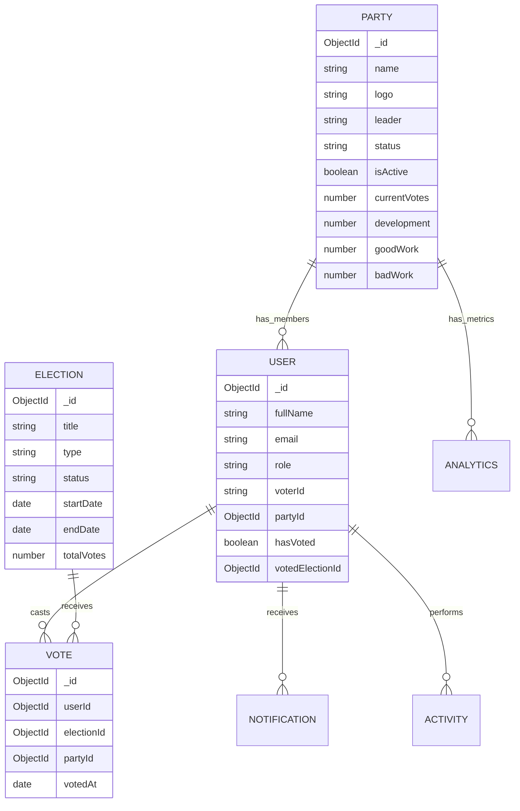
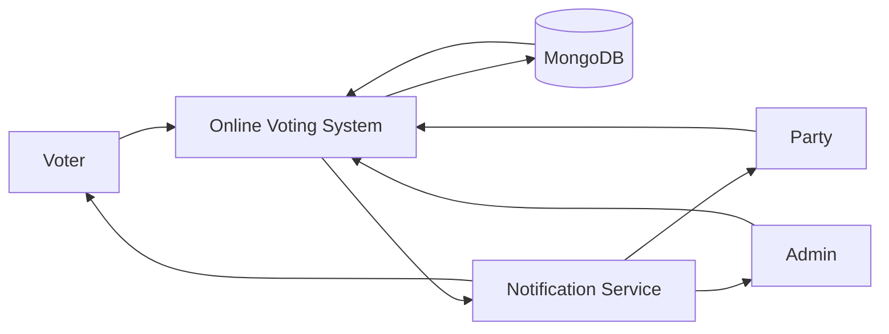
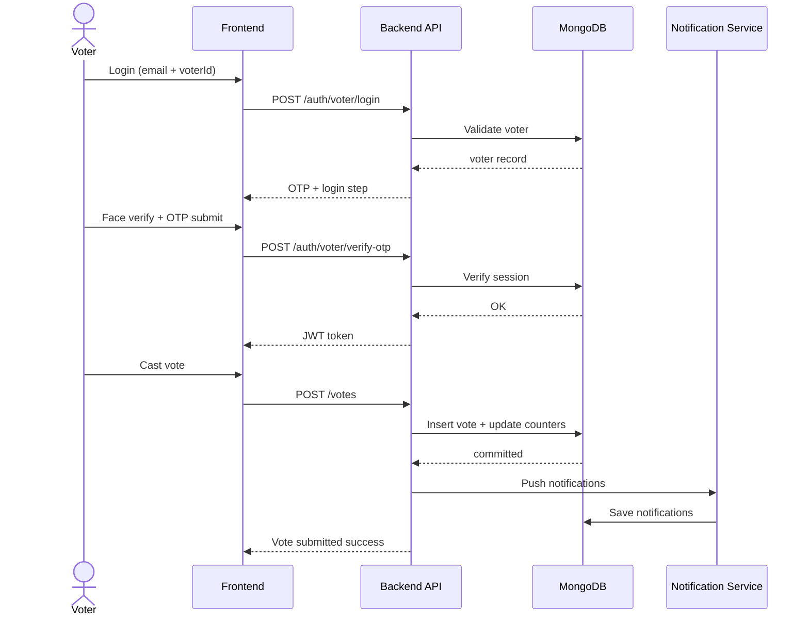

# System Diagrams (Quick Access)

Diagrams are available in two places:

1. `DIAGRAMS.md` (this file, root)
2. `docs/SYSTEM_DIAGRAMS.md` (detailed documentation)

## ER Diagram

## DFD (Level 0)

## Sequence (Vote Flow)

