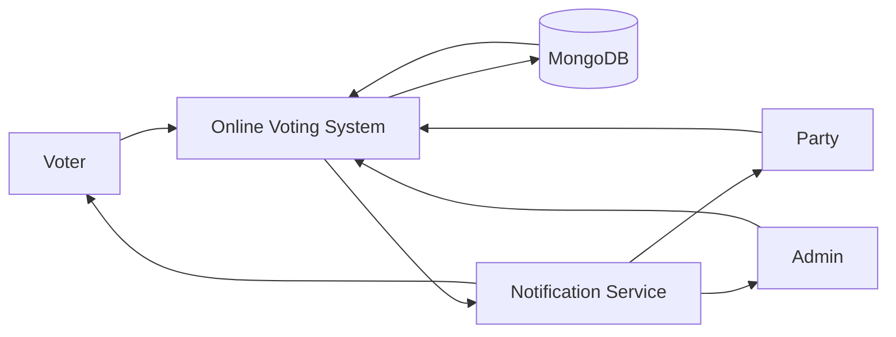
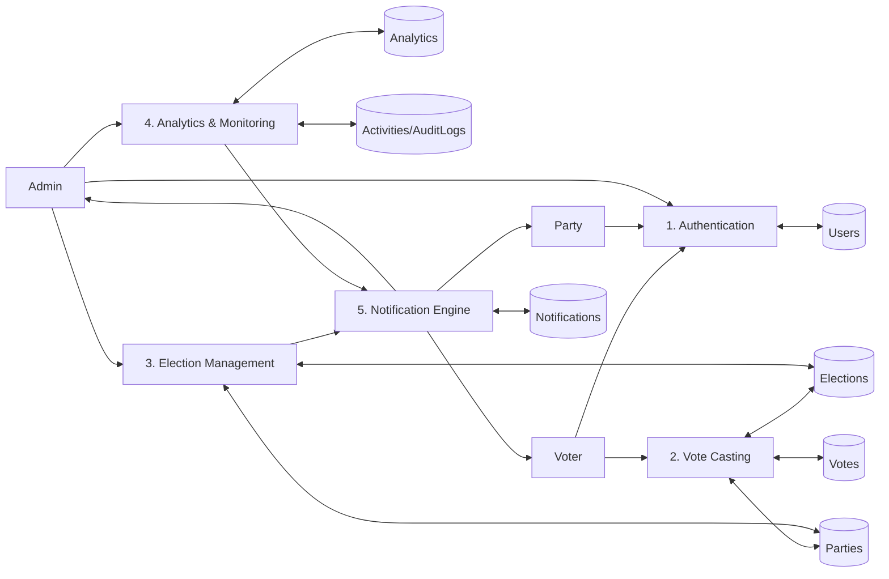
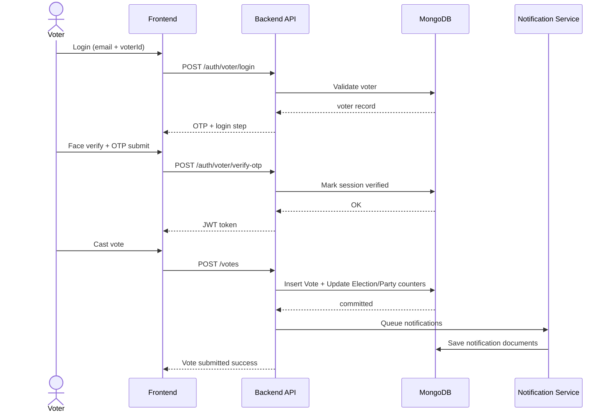

# Online Voting System Diagrams

This file contains Mermaid diagrams for the current backend schema and key flows.

## ER Diagram

```mermaid
erDiagram
  USER ||--o{ VOTE : casts
  ELECTION ||--o{ VOTE : receives
  PARTY ||--o{ USER : has_members
  PARTY ||--o{ ELECTION : participates_in
  USER ||--o{ NOTIFICATION : receives
  USER ||--o{ ACTIVITY : performs
  USER ||--o{ AUDITLOG : generates
  PARTY ||--o{ ANALYTICS : has_metrics

  USER {
    ObjectId _id
    string fullName
    string email
    string role
    string voterId
    ObjectId partyId
    boolean hasVoted
    ObjectId votedElectionId
    boolean isVerified
    date createdAt
  }

  PARTY {
    ObjectId _id
    string name
    string logo
    string leader
    string status
    boolean isActive
    number currentVotes
    number development
    number goodWork
    number badWork
    date createdAt
  }

  ELECTION {
    ObjectId _id
    string title
    string type
    string status
    date startDate
    date endDate
    boolean isActive
    boolean allowVoting
    number totalVotes
    number turnout
    boolean isEnded
  }

  VOTE {
    ObjectId _id
    ObjectId userId
    ObjectId electionId
    ObjectId partyId
    boolean faceVerified
    boolean otpVerified
    date votedAt
  }

  NOTIFICATION {
    ObjectId _id
    ObjectId userId
    string type
    string title
    string message
    boolean isRead
    date createdAt
  }

  ACTIVITY {
    ObjectId _id
    string action
    string message
    ObjectId userId
    string role
    date createdAt
  }

  AUDITLOG {
    ObjectId _id
    string action
    string user
    string role
    string details
    date timestamp
  }

  ANALYTICS {
    ObjectId _id
    ObjectId partyId
    number development
    number goodWork
    number badWork
    date createdAt
  }
```

## DFD (Level 0)

## DFD (Level 1)

## Sequence Diagram (Voter Vote Flow)

